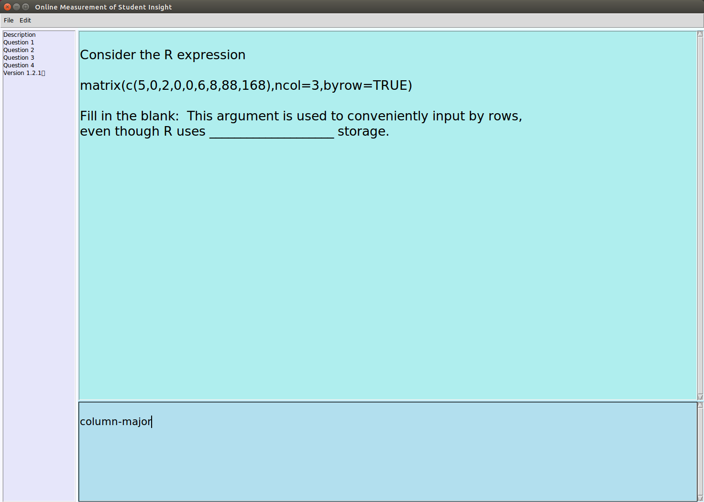
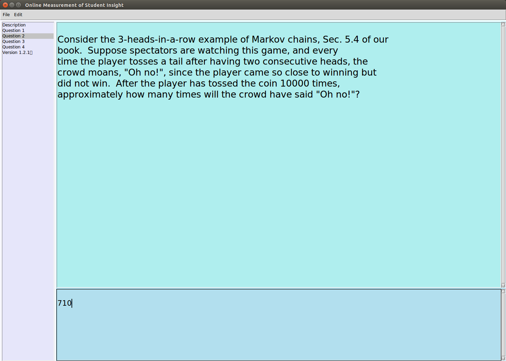
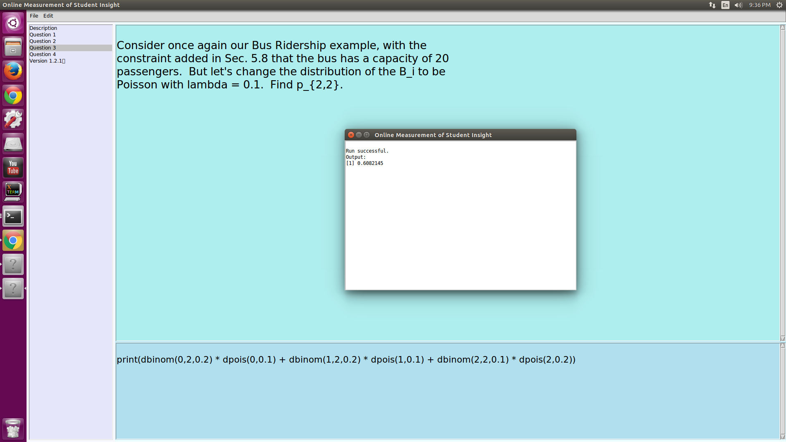
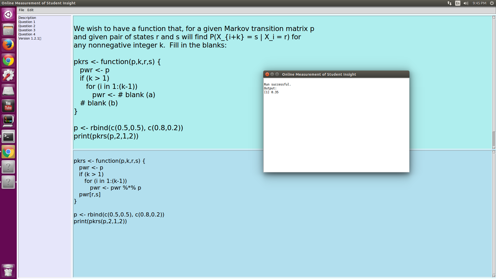

# OMSI: Online Measurement of Student Insight 

## Example: Real exam problems from ECS 132, UC Davis

After connecting (**File | Connect**) to the server and selecting
Question 1, the student will see this OMSI screen:

The bottom area is for the student's answer.  The student fills it in:

The student must also remember to click **File | Save** and **File | Submit**.

The student then moves on to Question 2, which had an easy,
straightforward answer from the course textbook (and it was an open-book
exam).  The student then answers:

Now, on to Question 3:

Question 3 asked for executable R code.  The student filled in the
answer, then hit **File | Save** and **File | Run**.  The latter action
brought up the pop-up run window, with the result of the run.

Finally, the student tackled Question 4. In contrast to the previous
questions, which were math questions even though the answers were
expressed in R, this question asked the student to read a full R
function. Since this might be hard under the time constraints of an
exam, the instructor wrote most of the code, leaving just a couple of
blanks for the student to fill in.

First the student copied the contents of the Questions window to the
Answers window, by selecting **File | CopyQtoA**.  Then she edited out
the noncode lines, and filled in the blanks in the code.  Then she saved
and ran the code.

The student made sure that all her answers had been submitted (each
submission for a problem overwrites the last), exited OMSI, and went
home happy. :-)

